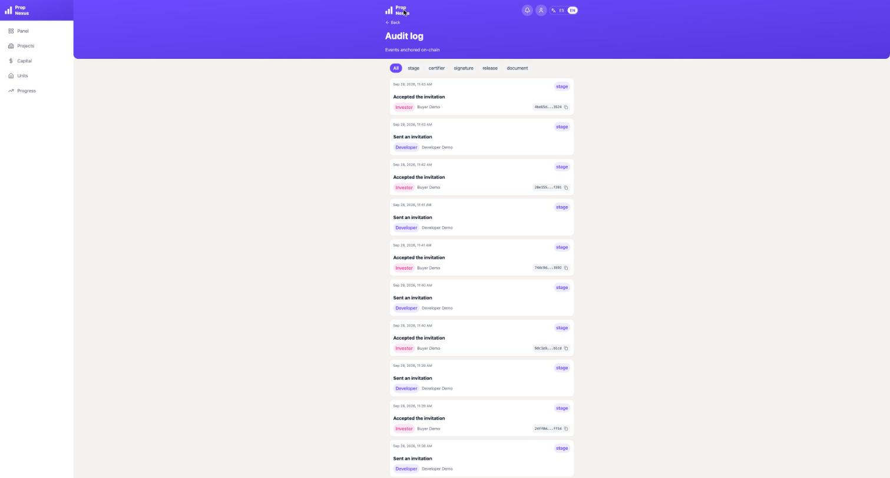
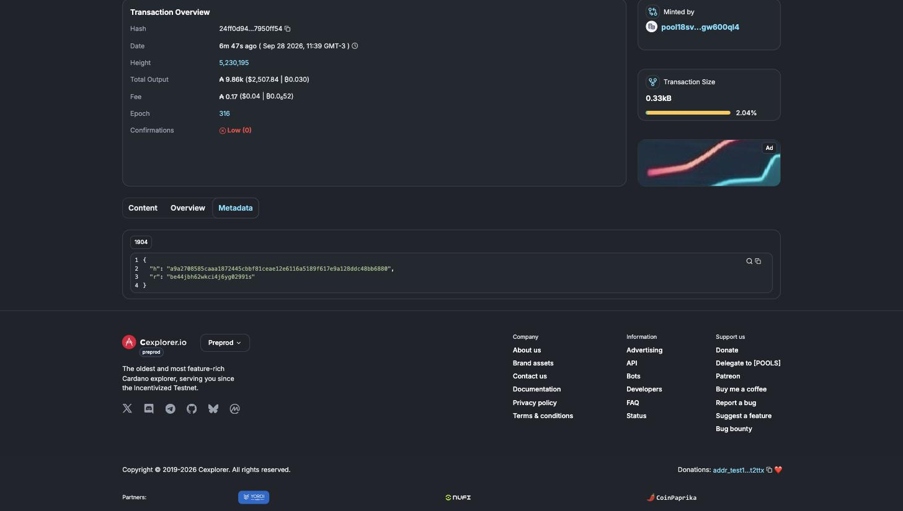

# Reservation → escrow latency on Cardano Preprod (2026-09-28)

> Milestone 3 evidence: *"median time from reservation to escrow creation <12 minutes; audit logs
> persisted"* and *"screenshots of audit logs/latency confirming <12m median; short performance
> note"*.

## Result

**Median: 0.33 minutes (≈ 20 seconds). Target: < 12 minutes.** Maximum: 0.86 minutes (≈ 52
seconds). Every sample reached a block in under one minute.

| | Value |
|---|---|
| Samples | 6 (5 new on 2026-09-28 + 1 earlier, from 2026-09-11) |
| Median, reservation → escrow on chain | **0.33 min** |
| Maximum | 0.86 min |
| Samples with a confirmed block timestamp | 6 of 6 |
| Network fee per escrow transaction | 0.170341 tADA |

Those are the numbers the application reports about itself
([`reservation-to-escrow-telemetry-2026-09-28.json`](reservation-to-escrow-telemetry-2026-09-28.json),
the verbatim response of `GET /api/v1/audit-logs/telemetry/reservation-to-escrow`). The table below
re-derives each sample **independently of the application's database**: the start comes from the
audit log and the end from the chain itself (Koios). Recomputed that way, the median is 0.31 min and
the maximum 0.84 min. The ~1–2 s difference is expected. The telemetry starts its clock when the
on-chain event is recorded, which happens just before the audit-log entry is written.

## What is measured

"Escrow" here means the purchase **contract created and anchored on Cardano**. It never means funds
held: PropNexus custodies no value, on chain or off chain. The clock:

- **starts** when the investor accepts the invitation to buy a unit (the reservation), and
- **stops** when the transaction that anchors that acceptance is included in a Preprod block (the
  block's own timestamp, read from the chain).

## How the samples were produced

Everything was done in production (`propnexus-web.onrender.com`, Cardano Preprod) through the real
web app in a browser (Claude in Chrome), one browser tab per role. No direct API call triggered any
of the steps. On project `Torre Volumen 3`, for each of five new units `7A`…`7E`:

1. **Developer:** *Manage units* → *Add unit*.
2. **Developer:** *Invite investor* → `buyer@example.com`, the unit, an amount → *Send invitation*.
3. **Investor:** opens the invitation link → *View invitation* → *Accept invitation*.
4. The backend builds, signs and submits the anchoring transaction on its own. Nobody waits or
   clicks anything else.

The five purchases were made back to back, about one minute apart.

## Samples

| Unit | Accepted (UTC) | In block (UTC) | Block | Seconds | TXID |
|---|---|---|---|---|---|
| (earlier sample) | 2026-09-11 13:43:07.792 | 13:43:33 | 5164428 | 25.2 | `8984e361…cdb012` |
| 7A | 2026-09-28 14:39:34.953 | 14:39:43 | 5230195 | 8.0 | `24ff0d94…50ff54` |
| 7B | 2026-09-28 14:40:31.585 | 14:41:05 | 5230200 | 33.4 | `9dc1e9b4…07b1cd` |
| 7C | 2026-09-28 14:41:33.424 | 14:41:34 | 5230202 | 0.6 | `74dc9d43…533592` |
| 7D | 2026-09-28 14:42:39.436 | 14:42:52 | 5230210 | 12.6 | `28e1552f…e7f281` |
| 7E | 2026-09-28 14:43:29.766 | 14:44:20 | 5230213 | 50.2 | `4be65d5d…943524` |

Full TXIDs, invitation IDs and explorer links are in
[`reservation-to-escrow-samples-2026-09-28.csv`](reservation-to-escrow-samples-2026-09-28.csv). For
every row, the transaction's on-chain metadata (label `1904`) carries the invitation ID as its
reference (`r`), so each TXID can be tied to its reservation from the chain alone.

**Why the spread (0.6 s to 50 s).** Once the transaction is submitted, what is left is waiting for
the next Preprod block, which arrives every ~20 s on average but at irregular intervals. The
application itself adds only a few seconds: build, sign, submit.

## Screenshots

**The audit log (developer view).** All ten events of the five new samples: each *Sent an
invitation* by the developer, followed by *Accepted the invitation* by the investor with its
anchoring TXID. These entries are persisted, append-only, and still visible after the session.

**One of the transactions in a public explorer** (unit 7A, `24ff0d94…50ff54`). The block time
(11:39 GMT-3 = 14:39 UTC), the block height, and the metadata that carries the invitation ID
(`be44jbh62wkci4j6yg02991s`) and a hash commitment.

