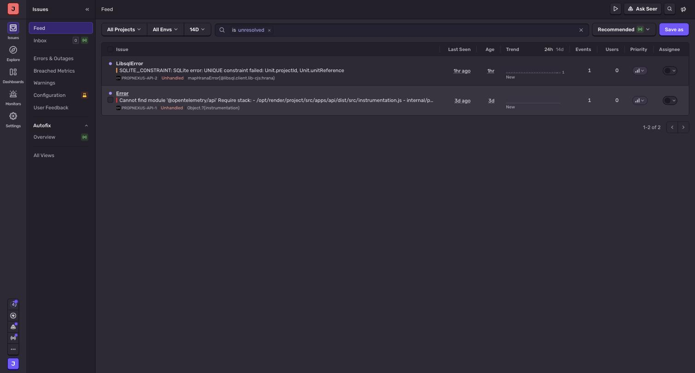
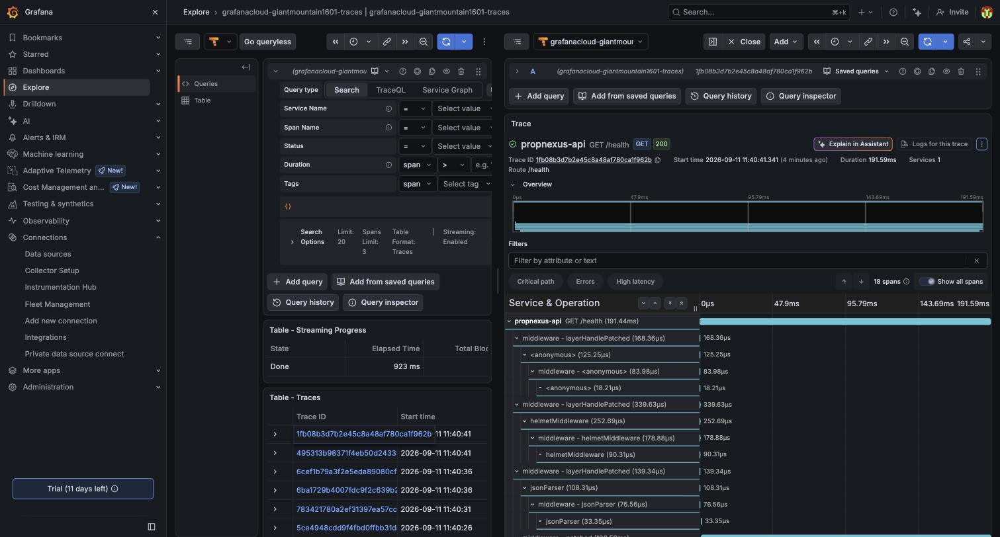
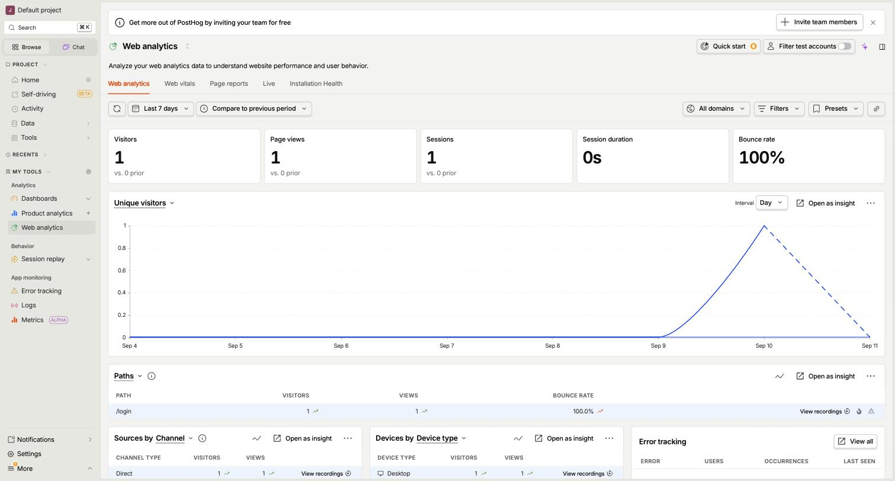
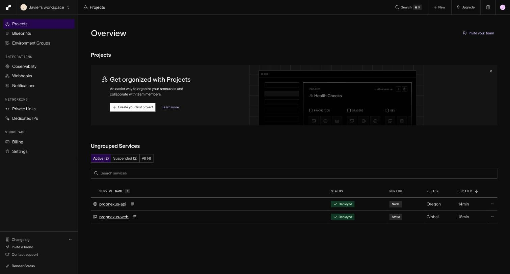

# Monitoring screenshots

> Milestone 3 evidence: *"Ops runbook (deploy/rollback/incident) in repo + **monitoring
> screenshots**"*. The three monitoring services — Sentry
> (errors), Grafana Cloud / Tempo (traces and metrics), PostHog (web analytics, no PII) — were
> instrumented in code (`apps/api/src/instrumentation.ts`, `apps/web/src/lib/observability.ts`) and
> verified live in production on 2026-09-08. The screenshots were captured on 2026-09-11, directly
> against the live dashboards.

**No staged data.** Every screenshot below shows what each service reported at capture time,
unedited — real traffic and real errors from the production instance
(`propnexus-api.onrender.com` / `propnexus-web.onrender.com`), not a mock or a seeded demo state.

## How this also covers Output 4's telemetry

Output 4 (*Testing & Security*) asks for *"telemetry for coverage/latency/error budgets"*. The
same instrumentation shown on this page provides two of the three, and the test report provides
the third:

| Telemetry | Where it comes from | Evidence |
|---|---|---|
| **Coverage** | Vitest coverage on every CI run; all four TypeScript parts have minimum thresholds that fail the build | The coverage table in the [test report](../1-repo-ci-tests/test-report.pdf) (100% of lines) |
| **Latency** | OpenTelemetry traces of every API request, exported to Grafana Cloud (Tempo), with per-middleware timing | `grafana-tempo-trace-detail.jpg` below |
| **Error budgets** | Sentry captures every unhandled error in the API and the web app | `sentry-issues.jpg` below |

The reservation → escrow latency that acceptance criterion 3 measures (median under 12 minutes)
is a separate, product-level metric, served by the API at
`GET /api/v1/audit-logs/telemetry/reservation-to-escrow` and reported under evidence item 3.

**What is not in place yet:** no formal error-budget target (an SLO such as "99% of requests
without a 5xx over 30 days") has been set. Sentry records the errors a budget would be computed
from; setting the target itself is left for before mainnet.

## Files

All under [`monitoring/`](monitoring/).

### `sentry-issues.jpg`

Sentry's issue feed for the `propnexus-api` project, filtered to unresolved issues. Two real,
unhandled errors are visible:

- `LibsqlError — SQLITE_CONSTRAINT: UNIQUE constraint failed: Unit.projectId, Unit.unitReference`,
  1 hour old at capture time. This one is incidental, not a monitoring artifact: it was produced
  during this same session's manual exercise of the reservation-to-escrow flow, submitting a unit-creation
  form twice against the same reference. Left in the screenshot on purpose, as further proof the
  pipeline captures real errors as they happen, not synthetic ones.
- `Error — Cannot find module '@opentelemetry/api'`, 3 days old — a historical, already-fixed
  incident whose issue entry is still open in Sentry because nobody has manually resolved it there;
  the underlying bug has been fixed in code since.

### `grafana-tempo-trace-detail.jpg`

Grafana Cloud → Explore → the `grafanacloud-giantmountain1601-traces` (Tempo) datasource. Left
panel: the trace search table over the last 24 hours, real `propnexus-api` `GET /health` traces
with real timestamps and durations. Right panel: one of those traces opened to its full waterfall
— 18 spans, per-middleware timing breakdown (`helmetMiddleware`, `jsonParser`, etc.), 191.59 ms
total duration, HTTP 200.

### `posthog-web-analytics.jpg`

PostHog → Web analytics, last 7 days, for the `apps/web` production deployment. Shows a real
visitor session against `/login` on 2026-09-10, with visitor/pageview/session counts, bounce rate,
and the unique-visitors time series. (The dedicated "Web vitals" tab returned no data for the
selected range — traffic volume so far is too low for that specific metric to have recorded; the
general Web analytics view already demonstrates the pipeline is live and receiving real events,
which is what the evidence asks for.)

### `render-services-deployed.jpg`

Not required on its own (the public URL is covered elsewhere), included as supporting context: both Render services, `propnexus-api` and `propnexus-web`, `Deployed` at
capture time.

## Summary

| Service | What it monitors | Status at capture |
|---|---|---|
| Sentry | Application errors (`apps/api`) | Live, 2 real unresolved issues |
| Grafana Cloud (Tempo) | Distributed traces (`apps/api`) | Live, real traces in the last 24h |
| PostHog | Web analytics (`apps/web`) | Live, real session recorded |
| Render | Deploy status (both services) | `Deployed`, both |
